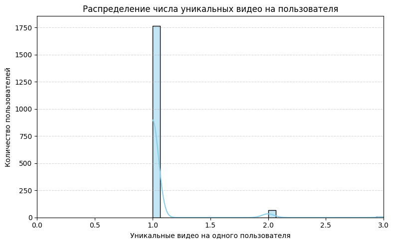
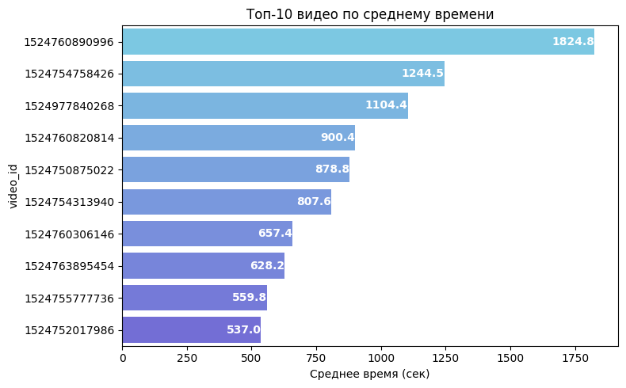
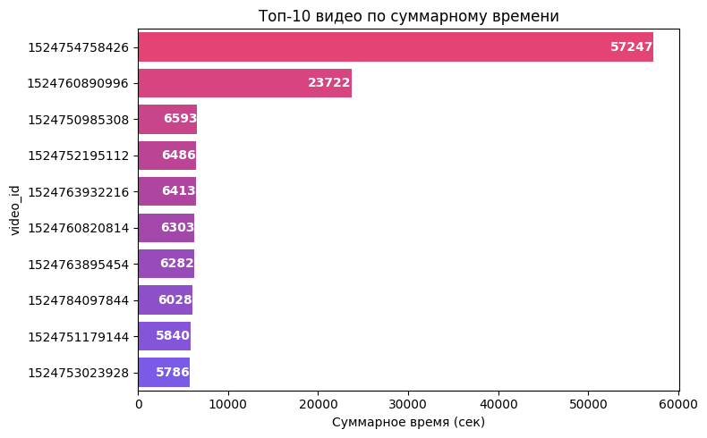

# Анализ видеосессий VK Видео  |  EDA → инсайты → рекомендации

## Задача
Однодневный срез пользовательских видеосессий: очистка, EDA, источники трафика, вовлечённость по платформам, рекомендации.

## Стек
Python (pandas, numpy, matplotlib, seaborn), Jupyter/Colab, SQL

## Данные (словари полей)
| Поле | Описание |
|---|---|
| user_id | идентификатор пользователя |
| platform | android / ios |
| video_id | идентификатор ролика |
| video_owner_id | владелец контента |
| src | источник перехода (video_for_you, video_search, …) |
| total_view_time | время просмотра, сек |
Нули и сверхдлинные сессии отсекаются (99-й перцентиль).

Материалы

Отчёт (PDF): reports/VK.pdf

Ноутбук: notebooks/VK.py

Результаты (основные графики)
## Результаты (примеры графиков)

  
  

  
  

---

## 📬 Автор
**Денис Морозов**  
📧 Kor4yz@yandex.ru · [GitHub](https://github.com/Kor4yz) · [Telegram](https://t.me/kor4yz)
